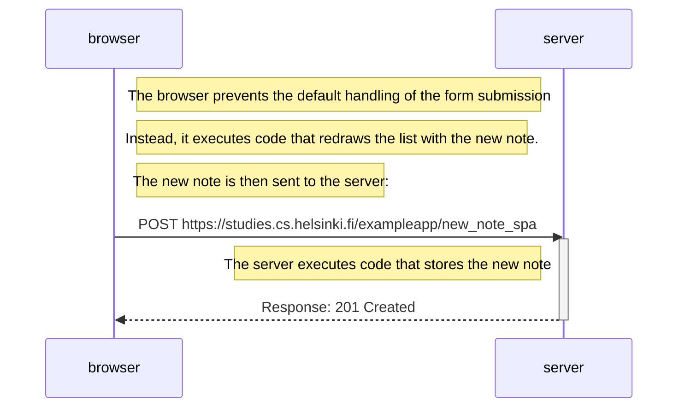

# Exercise 0.6

```mermaid
sequenceDiagram
    participant browser
    participant server

    Note right of browser: The browser prevents the default handling of the form submission
    Note right of browser: Instead, it executes code that redraws the list with the new note. 
    Note right of browser: The new note is then sent to the server:
    browser->>server: POST https://studies.cs.helsinki.fi/exampleapp/new_note_spa
    activate server
    Note left of server: The server executes code that stores the new note
    server-->>browser: Response: 201 Created
    deactivate server
```